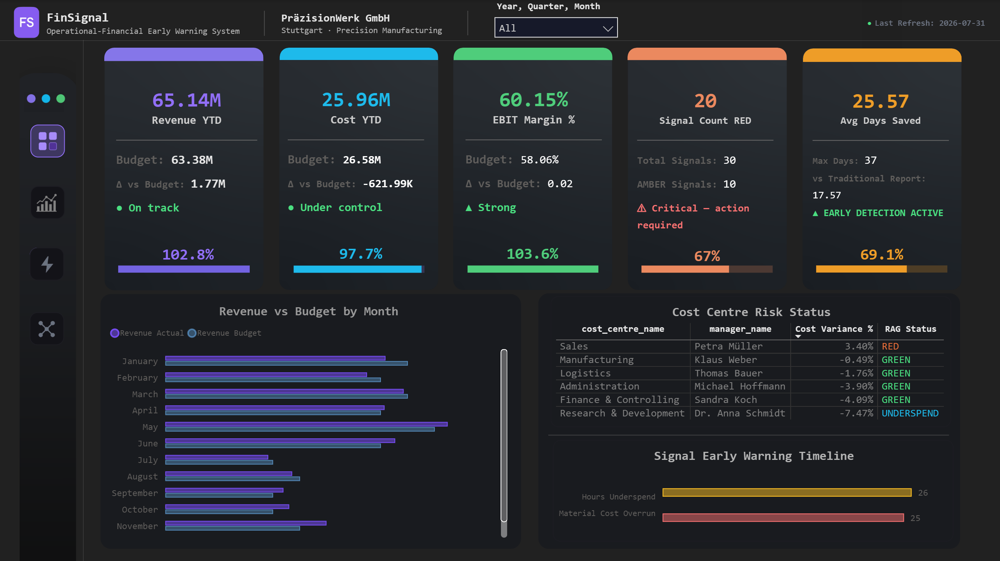
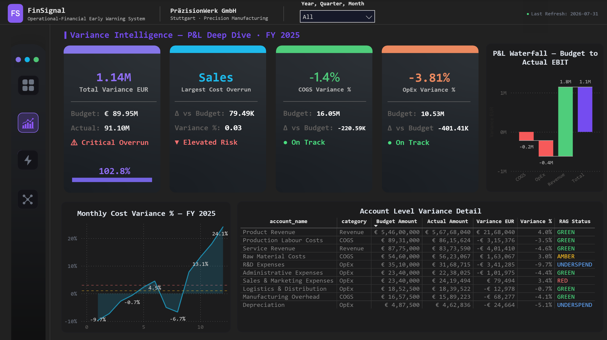
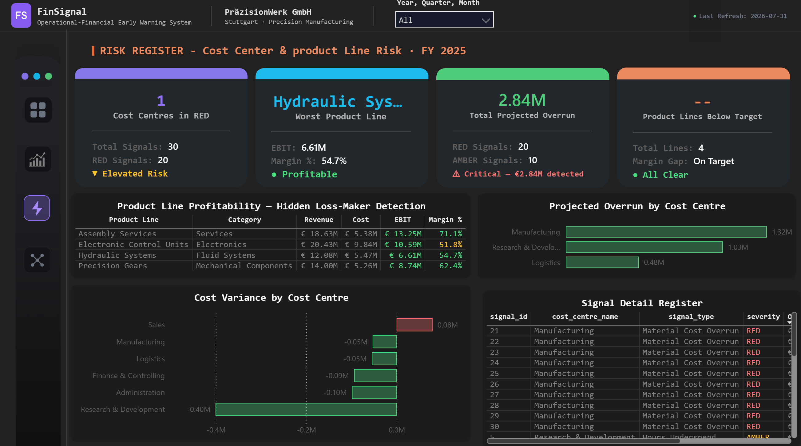
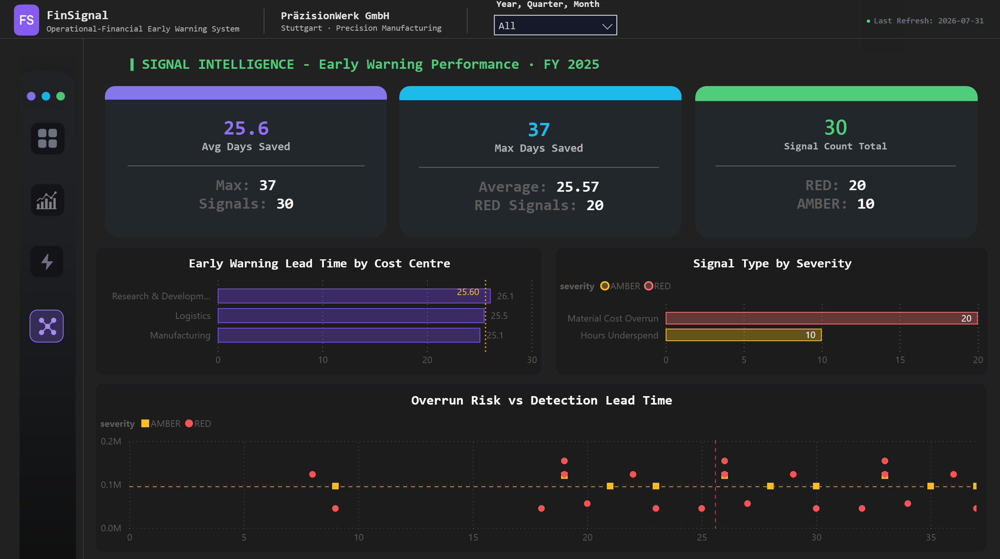

<div align="center">

# FinSignal

### Operational-Financial Early Warning System

**Catching budget overruns 25.6 days before the monthly Controlling report does.**

[](#)
[](#)
[](#)
[](#)

[Overview](#overview) • [Key Results](#key-results) • [Dashboard](#dashboard-walkthrough) • [Repository Structure](#repository-structure) • [Data Model](#data-model) • [SQL Analytics](#sql-analytics) • [Setup](#setup)

</div>

---

## Overview

Traditional monthly Controlling reports surface budget overruns **8 days after month-end close** — by the time Finance sees the problem, management reaction time is already zero.

**FinSignal solves this** by treating weekly operational data (production hours, material consumption, headcount, purchase orders) as *leading indicators* of financial variance — firing automated early warning signals weeks before the General Ledger reflects the problem.

Built as a complete, end-to-end Controlling system for a fictional German precision manufacturer — **PräzisionWerk GmbH**, Stuttgart, €45M annual revenue — covering everything from raw operational data to executive-ready Power BI dashboards.

See [`PROBLEM_STATEMENT.md`](./PROBLEM_STATEMENT.md) for the full business context.

> This is a portfolio project demonstrating production-grade BI engineering: star schema design, Python ETL, advanced SQL, and DAX-driven Power BI development — built to the same standard as a real Controlling analytics system.

---

## Key Results

<div align="center">

| Metric | Value |
|---|---|
| **Early warning lead time** | 25.6 days average · 37 days maximum |
| **Signals detected** | 30 total (20 RED critical · 10 AMBER elevated) |
| **Projected overruns caught early** | €2.84M across 6 cost centres |
| **Data quality** | 100% across 8 automated validation checks |
| **Data volume** | 2,340 GL entries · 474 operational records |

</div>

**Two real anomalies the system was built to catch:**
- **Manufacturing cost shock** — 22% over budget in Q1 2025, driven by a raw material cost spike, detected weeks before month-end close
- **Hidden loss-maker** — a product line (Electronic Control Units) showing healthy annual revenue but a specific month of negative EBIT, invisible at full-year aggregation and only surfaced when filtered to the anomaly period

---

## Dashboard Walkthrough

A single 4-page Power BI report (`powerbi/FinSignal.pbix`), navigated via bookmark-linked sidebar icons.

### 1 · Executive Pulse
Headline KPIs — Revenue, Cost, EBIT Margin, Signal Count, Days Saved — each with budget comparison, variance, and live RAG status. Revenue vs. Budget trend, Cost Centre Risk table, and Signal Early Warning Timeline.

### 2 · Variance Intelligence
P&L Waterfall from Budget to Actual EBIT. Monthly Cost Variance % trend with threshold bands. Full account-level variance detail across Revenue, COGS, and OpEx.

### 3 · Risk Register
Cost Centre and Product Line risk in one view — Product Line Profitability table with conditional "hidden loss-maker" detection, Cost Variance by Cost Centre, Projected Overrun by Cost Centre, and a full Signal Detail Register.

### 4 · Signal Intelligence
Proof of the core value proposition — Early Warning Lead Time by Cost Centre, Signal Type by Severity, and a Decision Quadrant scatter plot (Overrun € vs. Days Saved) for prioritizing which signals matter most.

---

## Screenshots

### Page 1 — Executive Pulse
Headline KPIs for PräzisionWerk GmbH — Revenue YTD €65.14M, EBIT Margin 60.15%, 20 RED signals active. Revenue vs Budget trend, Cost Centre RAG status, and the Signal Early Warning Timeline in one view.



### Page 2 — Variance Intelligence
P&L waterfall from Budget to Actual EBIT, monthly cost variance trend with threshold bands, and full account-level variance detail across Revenue, COGS, and OpEx.



### Page 3 — Risk Register
Cost centre and product line risk in one view. Product Line Profitability table with hidden loss-maker detection, Projected Overrun by Cost Centre, and a full Signal Detail Register — €2.84M in projected overruns traced to source.



### Page 4 — Signal Intelligence
Proof of the core result — 25.6 days average early warning lead time across 30 signals. Early Warning Lead Time by Cost Centre, Signal Type by Severity, and a Decision Quadrant scatter plot for prioritizing which risks matter most.



### Access the live dashboard


---

## Repository Structure

```
FinSignal/
├── data/
│   ├── raw/                  # Generated source data
│   └── processed/            # Transformed, validated data + DQ scorecard
├── docs/                     # Reserved — architecture diagram, Controlling memo (in progress)
├── etl/
│   ├── config.py             # Centralized project configuration — imported by all scripts, not run directly
│   ├── generate_data.py      # Step 1 — synthetic data generation
│   ├── transform.py          # Step 2 — cleaning, star schema load
│   ├── validate.py           # Step 3 — 8 automated data quality checks
│   ├── signal_engine.py      # Step 4 — early warning signal detection
│   └── summary_report.py     # Step 5 — generates weekly Controlling alert report
├── powerbi/
│   └── FinSignal.pbix        # 4-page executive dashboard
├── reporting/
│   └── weekly_signal_report.txt   # Auto-generated — overwritten on each summary_report.py run
├── sql/
│   ├── schema.sql             # Star schema DDL
│   └── analytics/             # 20 analytical queries — see below
├── PROBLEM_STATEMENT.md       # Business context and problem framing
├── finsignal.db                # SQLite database
└── requirements.txt
```

---

## Data Model

Star schema, SQLite — **3 fact tables, 5 dimension tables, 9 indexes**.

```
FACT_GL_ENTRIES ──┐
FACT_OPERATIONAL ─┼── DIM_DATE
FACT_SIGNAL_LOG ───┘── DIM_ACCOUNT
                       DIM_COST_CENTRE
                       DIM_SCENARIO
                       DIM_PRODUCT_LINE
```

| Table | Purpose |
|---|---|
| `FACT_GL_ENTRIES` | General Ledger transactions — Actual, Budget, Forecast |
| `FACT_OPERATIONAL` | Weekly operational KPIs — production hours, material, headcount |
| `FACT_SIGNAL_LOG` | Every early warning signal fired, with severity and lead time |
| `DIM_PRODUCT_LINE` | Product lines with individual margin targets |
| `DIM_COST_CENTRE` | Cost centre ownership and budget structure |

---

## SQL Analytics

**20 queries** in `sql/analytics/` — CTEs, window functions, `RANK()`, rolling averages.

| # | Query | Focus |
|---|---|---|
| 01 | `budget_vs_actual_by_cost_centre` | Variance & budget |
| 04 | `projected_monthend_variance` | Variance & budget |
| 05 | `cost_centre_ranking_by_variance` | Variance & budget |
| 13 | `prior_year_comparison` | Variance & budget |
| 16 | `top_overbudget_accounts` | Variance & budget |
| 02 | `pl_waterfall` | Trend analysis |
| 07 | `rolling_3month_cost_trend` | Trend analysis |
| 14 | `ebit_margin_trend` | Trend analysis |
| 19 | `scenario_comparison` | Trend analysis |
| 03 | `signal_detection_pace_calculation` | Signal engine |
| 09 | `signal_log_summary` | Signal engine |
| 10 | `early_warning_lead_time` | Signal engine |
| 11 | `manufacturing_anomaly_deep_dive` | Signal engine |
| 18 | `logistics_cost_spike` | Signal engine |
| 06 | `product_line_contribution_margin` | Product line & profitability |
| 08 | `contribution_margin_by_product_line` | Product line & profitability |
| 15 | `headcount_vs_budget` | Operational analysis |
| 17 | `rd_underspend_analysis` | Operational analysis |
| 12 | `cfo_executive_summary` | Executive reporting |
| 20 | `finsignal_performance_scorecard` | Executive reporting |

---

## Tech Stack

| Layer | Tools |
|---|---|
| **Database** | SQLite — star schema, 9 indexes |
| **ETL** | Python — `config` → `generate_data` → `transform` → `validate` → `signal_engine` → `summary_report` |
| **Analytics** | SQL — CTEs, window functions, `RANK()`, rolling averages |
| **Visualization** | Power BI — DAX measures, conditional formatting, bookmark navigation |
| **Validation** | 8 automated data quality checks, 100% pass rate |

---

## Setup

```bash
git clone https://github.com/AIAnalyticsKureshi/FinSignal.git
cd FinSignal
pip install -r requirements.txt

# Run the ETL pipeline in order — config.py is imported automatically, not run directly
python etl/generate_data.py
python etl/transform.py
python etl/validate.py
python etl/signal_engine.py
python etl/summary_report.py   # regenerates reporting/weekly_signal_report.txt

# Open the dashboard
# powerbi/FinSignal.pbix — connect to finsignal.db via SQLite ODBC
```

---

## About

Built by **Mohammad M. Kureshi** — BI Analyst & Consultant, Berlin.

Three years of BI and analytics consulting across Germany, the UK, and India. FinSignal is one part of a broader portfolio of end-to-end BI systems — database design through executive dashboard, every line of code included.

[LinkedIn](https://www.linkedin.com/in/mohammad-kureshi) · [GitHub](https://github.com/AIAnalyticsKureshi)
